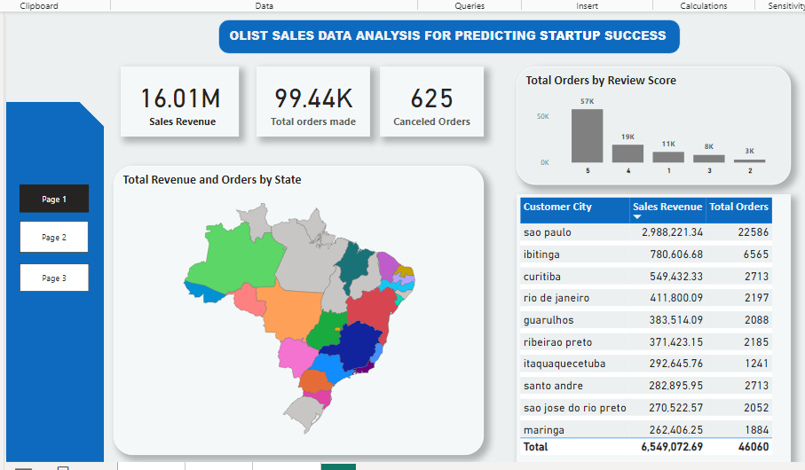
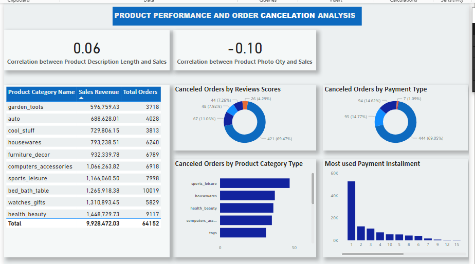
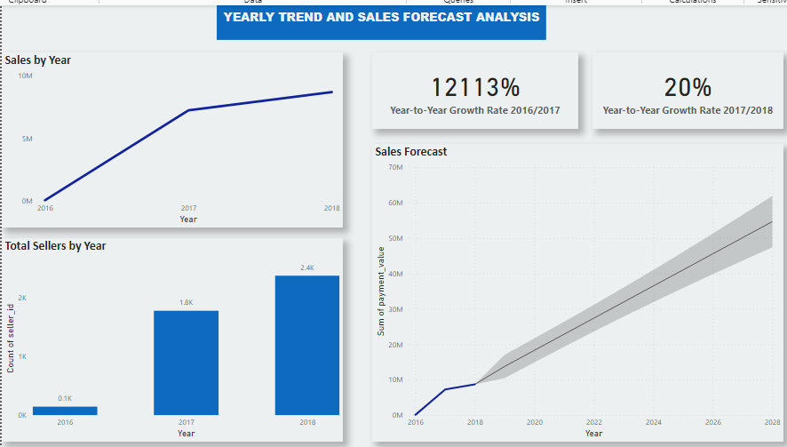

# Startup-Sales-Prediction-Analysis-
## Olist Sales Data Analysis For Predicting Startup Success

## Project Overview
In this startup sales prediction analysis, I leveraged Olist's comprehensive sales data to provide actionable insights and recommendations to a startup company looking to succeed in the Brazilian e-commerce market. The analysis explored various aspects of sales performance, product attributes, order cancellations, and market trends to guide the startup's strategic decision-making.

## Tools Used
- Microsoft Power BI
- Power Query Editor
- DAX (Data Analysis Expressions)

## Steps Covered
1. Compiling questions to be answered
2. Data modeling of 9 tables
3. Data cleaning using power query editor
4. Data processing through addition of custom columns
5. Data analysis using dax functions and
6. Data visualization / Dashboard creation using Power Bi

## Scenario Used
A startup company is interested in understanding the factors that contribute to successful sales performance in the Brazilian market so I was expected to analyze the Olist sales data and provide them with actionable insights to guide their business strategy and decision-making.

## Exploratory Data Analysis
Three dashboards were made, each a different analysis. Each analysis and the questions answered include:

**Market Potential Estimation Analysis:**
- What is the total sales revenue (plus shipping) generated, total orders made, and orders canceled?
- Which customer state and city generated the most revenue and had more orders?
- Customer feedback - What are the total orders gotten per review score?

  
**Product Performance Analysis and Order Cancelation Analysis:**
- Do products with longer description lengths sell more?
- Do products with more photos sell more?
- What product category sells more and which has more orders?
- For orders that are canceled, what factors do they have in common?
- People with what payment type are likely to cancel orders?
- Identify the most common number of installments and their impact on the overall sales.

  
**Yearly Trend and Sales Forecast Analysis:**
- What is the total revenue made by year? And identify the growth rate between these years.
- Analyze the growth of sellers.
- Sales prediction for the next 10 years.

## Key Insights
### 1. Market Potential Estimation:

- The startup generated $16.01M in sales revenue and received 99,441 total orders, with 625 orders canceled.
- The city of São Paulo was the top contributor, generating $2.98M in revenue and 22,586 orders. The regions with the highest sales potential are Sao Paulo, Ibitinga, and Curitiba, which account for the largest share of total sales revenue and orders. The startup should prioritize these regions in its marketing and expansion efforts.
- Customer feedback showed that 57% of orders had the highest review score of 5, indicating overall positive customer satisfaction.

### 2. Product Performance and Order Cancellation:
- Products with longer descriptions had a slightly positive correlation (0.06) with sales, while more product photos had a weak negative correlation (-0.10) with sales.
- The "health_beauty" category had the highest sales revenue ($1.448M) and the “bed_bath_table” category had the highest orders (10,019). The top-performing product categories are health_beauty, watches_gifts, and bed_bath_table contributing the highest sales revenue and total orders.
- The main reasons for order cancellation are related to review scores and payment types, with lower review scores and certain payment methods such as credit card, being associated with higher cancellation rates. The startup should focus on enhancing customer satisfaction and providing reliable payment options.
- Customers using the "credit card" payment type were more likely to cancel orders (69.05%).
- The most common installment plan was 1 payment, accounting for 52,546 orders.

### 3. Yearly Trend and Sales Forecast:
- The startup experience significant year-over-year growth, with a 20% increase from 2016 to 2017 and a 12113% increase in revenue from 2017 to 2018.
- The number of sellers also grew from 145 in 2016 to 2,383 in 2018.
- Using Power BI's built-in forecasting tool, the sales forecasts project a steady upward trend, reaching over $60M in revenue by 2028 suggesting a promising market opportunity for the startup to capitalize on.

---

## Recommendations
- Focus marketing and expansion efforts in the top-performing regions of São Paulo, Ibitinga, and Curitiba to capitalize on the existing market demand
- Prioritize and invest in the top-performing product categories (health_beauty, watches_gifts, bed_bath_table) to maximize sales potential.
- Implement robust customer service and payment processing protocols to address the order cancellation issues and improve customer satisfaction.
- Optimize product descriptions to leverage the positive correlation with sales.
- Capitalize on strong year-over-year growth and increasing seller base by investing in
scalability and operational efficiency.
- Continuously monitor market trends and adjust forecasts accordingly.
- Establish a data-driven culture within the organization for informed decision-making.
- Foster a culture of continuous improvement through feedback loops.

By addressing these key insights and recommendations, the startup can develop a comprehensive strategy to predict and drive successful sales performance in the Brazilian e-commerce market.
